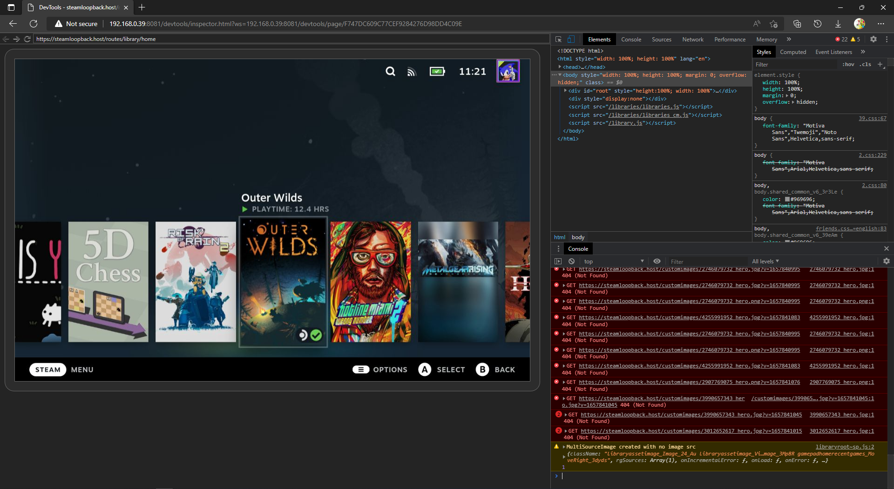

# :octicons-globe-16: CEF Debugger

The Chromium Embedded Framework (CEF) debugger is very useful for creating themes, as it allows you to play around directly with the style of the Steam Deck UI.

## Tabs

The debugger allows you to access tabs that are used for the UI. For Big Picture Mode, the main ones are listed below

- `Steam Big Picture Mode` - The main UI of the Steam Deck
- `QuickAccess` - The Quick Access overlay
- `MainMenu` - The Steam menu overlay

For Desktop, the main ones are listed below

- `Steam` - The main Steam window

## CSS Loader Decky Edition

### :material-check-decagram-outline: Recommended Setup

1. Turn on the "Allow Remote CEF Debugging" setting in the Decky settings.
2. Open a Chromium-based browser (ex. Google Chrome, Microsoft Edge, Brave).
3. Go to the inspect page of your browser (ex. chrome://inspect, edge://inspect, brave://inspect).
4. Under "Discover network targets", click "Configure", and enter "{DECK_IP}:8081".
      - You need to be on the same network as your Steam Deck.
      - You can find the IP of your Steam Deck by going into your internet settings, selecting the currently connected network, and looking at the "IP Address" field.
5. Wait a few seconds, and you will see multiple tabs appear under "Remote Target"
      - After selecting a tab, you should be able to see the HTML and CSS used for that specific tab, like the screenshot above.

### :material-clock-end: Legacy Setup

1. Turn on the "Allow Remote CEF Debugging" setting in the Decky settings.
2. Open a Chromium-based browser (ex. Google Chrome, Microsoft Edge, Brave).
3. Enter "http://{DECK_IP}:8081" in the browser.
      - You need to be on the same network as your Steam Deck.
      - You can find the IP of your Steam Deck by going into your internet settings, selecting the currently connected network, and looking at the "IP Address" field.
4. Select a tab.
      - After selecting a tab, you should be able to see the HTML and CSS used for that specific tab, like the screenshot above.

## CSS Loader Standalone (Windows) Edition

### :material-check-decagram-outline: Recommended Setup

1. Open a Chromium-based browser (ex. Google Chrome, Microsoft Edge, Brave).
2. Go to the inspect page of your browser (ex. chrome://inspect, edge://inspect, brave://inspect).
3. Under "Discover network targets", click "Configure", and enter "localhost:8080".
4. Wait a few seconds, and you will see multiple tabs appear under "Remote Target".
      - After selecting a tab, you should be able to see the HTML and CSS used for that specific tab, like the screenshot above.

### :material-clock-end: Legacy Setup

1. Open a Chromium-based browser (ex. Google Chrome, Microsoft Edge, Brave).
2. Enter "localhost:8080" in the browser.
3. Select a tab.
      - After selecting a tab, you should be able to see the HTML and CSS used for that specific tab, like the screenshot above.