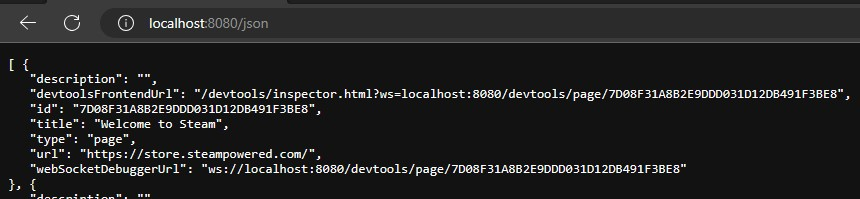

!!! question "The [source code of CSS Loader](https://github.com/suchmememanyskill/SDH-CssLoader) can be found here"

## :material-brush: Simple Themes
*Requires Manifest Version 1+*

Themes are folders with CSS files and a single `theme.json` file inside. The `theme.json` determines how everything will be displayed and any options if the theme has them. The CSS Loader loads themes from `/home/deck/homebrew/themes`.


[Here is an example.](https://github.com/suchmememanyskill/Steam-Deck-Theme-Template/tree/main/Sample%20Simple%20Theme)

For a simple theme, the `theme.json` should look something like this.

```json
{
  "name": "Theme Title",
  "author": "GitHubUsername",
  "target": "Library",
  "manifest_version": 4,
  "description": "This is an example description.",
  "version": "v1.0",
  "inject": {
    "shared.css": ["SP"]
  }
}
```

- The name element describes the theme name. This is also used as the folder name for the theme store.
- The author element describes the theme author.
- An optional version field can be added. If no version field is found, the version defaults to `v1.0`.
- The manifest version tells the CSS Loader which version of `themes.json` you are using. The current version is `4`.
- An optional description can be added to show a text description in the theme store.
- The inject tab is a dictionary of relative CSS file paths as keys, and a list of tabs you want the CSS to be injected into.
- The target field describes what part of the UI your theme themes. This is only useful for submitting a theme. The following options are available, but more can be added by creating an [issue on github](https://github.com/DeckThemes/CssLoader-ThemeApi/issues):

<ul id="targets" style="margin-left: 40px;">
</ul>

<script>
  async function fetch_targets(){
    res = await fetch("https://api.deckthemes.com/themes/filters?type=CSS", {
      method: "GET",
      mode: "cors"
    });
    console.log(res);

    const json = await res.json()
    const elem = document.getElementById("targets")

    for (const [key, value] of Object.entries(json.filters)) {
      li = document.createElement('li');
      li.textContent = key;
      elem.appendChild(li);
    }
  }

  fetch_targets();
</script>

## :material-tab-search: Finding which tabs to inject to
CSS Loader has multiple ways of identifying which tab css should be injected to. A tab in this context refers to a virtual window, if you'd like to explore this, see the [CEF Debugger](Cef_Debugger.md)

```json
{
  "inject": {
    "shared.css": ["SP"]
  }
}
```

Specifically, which tab is "SP"?

### Injection via Tab name match


CSS Loader can inject css by the names of tabs. In the screenshot above, entering `"Steam Big Picture Mode"` as tab would inject into a tab named exactly `Steam Big Picture Mode`

CSS Loader can also regex match tabs, if tab names are a little more dynamic. For example, in the screenshot above, `QuickAccess_uid82` has numbers at the end that change every time Big Picture Mode is launched. To remedy this, `"QuickAccess.*"` can be used as tab name, which injects into the first tab starting with `QuickAccess`

!!! warning "CSS Loader v1.7.0"
    On manifest version 6 or below, or CSS Loader v1.6.x or below, one entry in the tabs list of a css file will always inject into either zero or one tabs. This becomes problematic if for example, two tabs are visible with the same name. Manifest version 7 or CSS Loader v1.7.0+ fixes this and allows to inject into multiple tabs using one named entry.

### Injection via Tab URL match
*Requires CSS Loader v1.5.0+*



CSS Loader can also inject css by a part of the internal URL used by Valve. A prime example for this would be the Steam store, as its tab name changes to the name of the game being viewed. The internal URL always contains `https://store.steampowered.com/`. A tab match can be constructed by writing the part of the URL between `~`, as example: `"~https://store.steampowered.com/~"`.


## :material-image: Complex Themes
*Requires Manifest Version 2+*


[Here is an example.](https://github.com/suchmememanyskill/Steam-Deck-Theme-Template/tree/main/Sample%20Advanced%20Theme)

A complex theme is a theme with patches. Patches are menus that apply additional CSS depending on the selection. The `theme.json` for a complex theme should look something like this.

```json
{
  "name": "Colored Toggles",
  "version": "v1.2",
  "author": "SuchMeme",
  "target": "System-Wide",
  "description": "this is an example description",
  "manifest_version": 2,
  "inject": {
    "shared.css": ["QuickAccess", "SP", "MainMenu"]
  },
  "patches": {
    "Theme Color": {
      "default": "Orange",
      "type": "dropdown",
      "values": {
        "Orange": {},
        "Lime": {
          "colors/lime.css": ["QuickAccess", "SP", "MainMenu"]
        },
        "Red": {
          "colors/red.css": ["QuickAccess", "SP", "MainMenu"]
        },
        "Magenta": {
          "colors/magenta.css": ["QuickAccess", "SP", "MainMenu"]
        },
        "Gradient RGB": {
          "colors/gradient_rgb.css": ["QuickAccess", "SP", "MainMenu"]
        },
        "Gradient Deck": {
          "colors/gradient_deck.css": ["QuickAccess", "SP", "MainMenu"]
        }
      }
    }
  }
}
```

> The patches section is a dictionary of patch names as key. The value is a dictionary where keys are it's options and their value is the applied CSS, similar to the "inject" section. The special key "default" is required to indicate a default option.

Patches allow for choosing between a dropdown, a checkbox (toggle), or a slider for patch selection using the `type` field.

### :fontawesome-solid-list: Dropdown
*Requires Manifest Version 2+*

`"type": "dropdown"`

This is the default value. This type gives a dropdown of all keys in the `values` dictionary. Choosing an option injects only the CSS specified within the selected value.


### :fontawesome-solid-sliders: Slider
*Requires Manifest Version 2+*

`"type": "slider"`

This type gives a slider with the labels of the points of all keys in the `values` dictionary. Choosing an option injects only the CSS specified within the selected value.


### :material-checkbox-marked: Checkbox (Toggle)
*Requires Manifest Version 2+*

`"type": "checkbox"`

This type represents the `values` field as a toggle. This type is unique in the sense that it limits what options you can put in the `values` dictionary. You need to have a `Yes` and a `No` option in the `values` dictionary, otherwise, the type falls back to a dropdown. When the toggle is on, `Yes` is selected, otherwise, `No` is selected.


### :material-file-hidden: None
*Requires Manifest Version 3+*

`"type": "none"`

Displays an arrow with the patch name. Has no functional use. For use with components.

## :material-plus: Additional Features

### :material-folder: Local Files

You can access files locally from CSS if you use the correct URL. You can access files like fonts, images, and more by using the following URL.

`/themes_custom/{your_theme_name}/{image_path}`

[Here is an example.](https://github.com/suchmememanyskill/Steam-Deck-Theme-Template/tree/main/Sample%20Background%20Theme)

### :material-zip-box: Adding Dependencies
*Requires Manifest Version 3+*

Dependencies are useful if you want to bundle another theme or want to make small modifications to an existing theme. All dependencies get enabled alongside your theme.

In the `themes.json` file, specify a field called `"dependencies"`. This is a dictionary in which the keys are the name of the theme you want to be dependencies, with their values being another dictionary. This dictionary's keys are the name of any patch this theme has, and the value is the name of a value in the patch. If you don't want to modify any patch value, write `{}` as the value.

```json
"dependencies": {
    "Switch Like Home": {
        "No Friends": "Yes"
    },
    "Clean Gameview": {}
}
```

> If a theme has a dependencies field like the one above, it will enable both Switch Like Home and Clean Gameview. Switch Like Home's 'No Friends' patch gets forced to 'Yes'.

[Here is an example.](https://github.com/suchmememanyskill/Steam-Deck-Theme-Template/tree/main/Sample%20Dependency%20Theme)

### :material-file-cabinet: Components

Components are a way to attach extra parts to a selectable patch option. Inside a patch, you can make a `"components"` field (its value is a list), and put the components inside.

#### :material-palette: Color Picker
*Requires Manifest Version 3+*


[Here is an example.](https://github.com/suchmememanyskill/Steam-Deck-Theme-Template/tree/main/Sample%20Color%20Picker%20Theme)

The color picker component injects a CSS variable with a user-specified color.

```json
"components": [
    {
        "name": "Background Picker",
        "type": "color-picker",
        "on": "_",
        "default": "#000",
        "css_variable": "test-main-color",
        "tabs": ["QuickAccess"]
    }
]
```

- `name` refers to the name of the component shown to the user
- `type` refers to the type of component
- `on` refers to what patch value the component should be displayed on
- `default` refers to what default hex color the color picker should default to
- `css_variable` refers to the name of the CSS variable that will be injected
- `tabs` refers to what tabs the CSS variable will be injected into

#### :material-camera: Image Picker
*Requires Manifest Version 4+*


[Here is an example.](https://github.com/suchmememanyskill/Steam-Deck-Themes/tree/main/static-background)

The image picker component injects a user-supplied file using a file picker into a CSS variable as `url(path/to/file)`. Only files from `~/homebrew/themes` can be selected.

```json
"components": [
    {
        "name": "Image Picker",
        "type": "image-picker",
        "on": "_",
        "default": "ThemeName/background.jpg",
        "css_variable": "test-main-image",
        "tabs": ["SP"]
    }
]
```

- `name` refers to the name of the component shown to the user
- `type` refers to the type of component
- `on` refers to what patch value the component should be displayed on
- `default` refers to what default file path the image picker should default to (relative to `~/homebrew/themes`)
- `css_variable` refers to the name of the CSS variable that will be injected
- `tabs` refers to what tabs the CSS variable will be injected into

### :material-format-letter-spacing-variant: CSS Variables
*Requires Manifest Version 5+*

Instead of creating a single file that just stores 1 css variable, a shorthand is available to do it directly in the `theme.json`.

```json
"inject": {
  "shared.css": ["SP"],
  "--my-cool-css-var": ["#FFF", "SP"]
}
```

By putting 2 dashes in front of a key in any inject section, CSS Loader will read the first variable of the key's value, and inject that into the remaining array elements as tabs.

### :fontawesome-solid-flag: Feature Flags
*Requires Manifest version 6+*

Flags manipulate how a theme is intepreted by CSS Loader. This is used to enable specific niche functionality. There are currently 3 flags

- `PRESET`: Handles the theme as a preset. Please do not add this flag manually
- `KEEP_DEPENDENCIES`: Added to emulate old behaviour. If this flag is present, when a theme with dependencies is disabled it's dependencies are not disabled.
- `OPTIONAL_DEPENDENCIES`: Shows a modal when enabling a theme with this flag present. This modal asks the user if they want to enable the theme, it's dependencies and configure the dependencies.
- `REQUIRE_NAV_PATCH`: Forces patching the SteamUI controller navigation. See below for more details.

In theme.json:
```json
"flags": [
  "PRESET",
  "KEEP_DEPENDENCIES",
  "OPTIONAL_DEPENDENCIES",
  "REQUIRE_NAV_PATCH"
],
```

### :material-dock-window: Tab mappings
*Requires Manifest version 7+*

To avoid copy pasting the same tabs over and over, manifest v7 introduces a feature called tab mappings. This allows you to create custom definitions for tabs that will get replaced with the tabs defined in a tab mapping

```json
"tabs": {
    "custom_name": ["Steam Big Picture Mode", "MainMenu.*"]
},
"inject": {
    "shared.css": ["custom_name"],
    "shared2.css": ["custom_name"]
}
```

The above will inject shared.css and shared2.css into the Steam Big Picture Mode and MainMenu tabs.

```json
"tabs": {
    "default": ["Steam Big Picture Mode", "MainMenu.*"]
},
"inject": {
    "shared.css": [],
    "shared2.css": []
}
```

A special tab mapping name called "default" can be used to create a custom default when no tabs are specified. This will result in the same behaviour as the first example.


### :material-hammer-wrench: Nav Patching
*Requires Manifest version 9+*

When hiding elements that are selectable by controller navigation, it most of the time is still selectable by controller navigation, despite it being hidden. The 'Nav Patch' fixes this by checking for `display: none;` on .Focusable elements, and skipping those in the controller navigation routine.

You can enable this by putting `REQUIRE_NAV_PATCH` in your theme's flags.

### :material-rename: Renaming themes
*Requires Manifest version 9+*

The `name` attribute in the theme.json has been used in store submissions to name the theme's folder as well. This makes it tricky to change the name of the theme, as it's folder also changes. It's essentially treated as a new theme.

Manifest v9 solves this by introducing the `display_name` attribute. This attribute allows you to set the name that is displayed to users, while keeping the folder name the same.

```json
{
    "name": "My epic theme",
    "display_name": "My epic theme special edition"
}
```

### :material-checkbox-multiple-outline: Multiple targets
*Requires Manifest version 9+*

On the DeckThemes site it has always been enforced that a theme could only use a single target. Since manifest v9 it is possible to specify a JSON array of targets. This makes marking a theme with multiple targets possible.

```json
{
    "name": "My epic theme",
    "target": ["Home", "Library"]
}
```

### :material-compass: File watcher
*Requires CSS Loader version 1.4.0+*

If a file called `WATCH` is detected in the themes folder, CSS Loader will start watching file changes to any css file in any theme directory. This may lead to buggy behavior, so it's not enabled by default. This means that if any css file gets edited remotely, CSS Loader will automatically reload all themes, so you can 'live edit' css files.

*Updated in CSS Loader version 1.9.0+*

This feature can now be enabled from the settings menu of CSS Loader, under the name `Live CSS Editing`