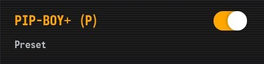

# Presets

Presets are themes that store configuration of other themes. This way, an entire set of themes and their configuration can be shared or stored in a preset theme.

When enabling a preset, it will enable all themes in the preset's configuration, and overwrite the configuration of those themes with the configuration stored in the preset.

When disabling a preset, it will disable all themes in the preset's configuration.

## Creating a preset

First, enter the CSS Loader QAM menu
1. Open the Quick Access Menu
2. Select the 'Plug' tab
3. Select 'Css Loader'

Then
1. Scroll to the bottom and select 'Your Themes'
2. Scroll to the bottom of the opened modal and select 'Create preset'
3. Give the preset a name and select 'Create'
    - This will store all currently active themes and their configuration in a new preset

## Using a preset

Presets are shown as regular themes. Instead of showing the version and author of a theme, it simply shows the text 'Preset'. Enabling and disabling a preset works the same as a regular theme.

## Sharing a preset

!> If the preset was created with a theme using a custom image, you are required to put this image in the preset's directory for it to be shared properly. To update the preset after changing the image's location, create a preset with the same name

0. For steam deck users: Go into desktop mode
1. Open dolphin (linux) and navigate from the home tab to the `homebrew` directory, then to the `themes` directory. 
    - The technical path name for this would be `~/homebrew/themes`
    - For CSS Loader Desktop users, open CSS Loader Desktop, go to `Manage Themes` then select `Open Themes Directory`
2. Find a directory with the same name as your preset
3. Right click this directory, and compress as .zip

You can now share this .zip file with friends. This will give an identical setup to when the preset was created. Note the themes used in the preset have to be downloaded first

### Sharing to deckthemes.com
These presets can also be shared to the theme repository. See [the submission docs](/Submission.md#zip) for more details. The gist of it is as follows:

1. Navigate to [DeckThemes](https://deckthemes.com/submit)
2. Log in with discord
3. Press the upload arrow in the top right
4. Set the `Upload Method` dropdown to `Upload Zip`
5. Upload your preset zip
6. Submit!