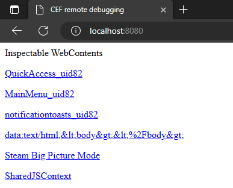

This page will guide you through creating a theme using CSS Loader

## Prerequisites

- Knowledge of CSS and JSON
  - If you don't know CSS, [W3Schools](https://www.w3schools.com/css/default.asp) docs are a great starting point.
- CSS Loader
  - Instruction for installing CSS Loader on Steam Deck or Windows can be found [here.](INSERT LINK IM LAZY)
  - If you are on Steam Deck, it is recommended to have an external monitor or PC/Laptop for developing.
    - When developing on a different device than the one running CSS Loader, you should have knowledge of how to transfer files between your current device and your Deck.
      - First, enable ssh on the Steam Deck using Konsole on desktop mode: `sudo systemctl enable sshd && sudo systemctl start sshd`. Then, on the external PC/Laptop install WinSCP, and enter your Steam Deck IP, username (by default `deck`) and password. Steam Deck IP can be found in system settings, under your WIFI connection.
- Visual Studio Code
  - Downloads for VSCode can be found [here.](https://code.visualstudio.com/)
  - Additionally, we recommend the use of extensions to help you write error-free JSON and CSS.
    - [CSS Loader for VSCode](https://marketplace.visualstudio.com/items?itemName=DeckThemes.css-loader-for-vs-code) gives you descriptions of all of the properties in a `theme.json` file.
    - [Error Lens](https://marketplace.visualstudio.com/items?itemName=usernamehw.errorlens) helps you to spot errors in both CSS and JSON files.

## Introduction to CSS and Steam UI

Desktop Steam, as well as the Big Picture/Steam Deck UI are written as webpages. Being webpages means that you can style them using web languages, namely CSS. CSS, or Cascading Style Sheets, is a language that defines rules for how a webpage should look.

For example, consider the following css rule:

```css
p {
  color: black;
  background-color: lightblue;
}
```

This rule states that all paragraphs, or `<p>` elements, will have a light blue background with black text.

<p style="color: black; background-color: lightblue;">This is a paragraph element with the above styling applied</p>

Under the hood, Steam uses version 85 of the Chromium Embedded Framework (CEF). This makes it near-identical to any installation of Google Chrome version 85.

Additionally, just like a regular browser, CEF can open multiple tabs. Steam uses this feature to display different parts of the UI.

Here's an example of the tabs the Big Picture Mode UI uses:

{align=left}

- `QuickAccess_uid(number)`: When the :material-dots-horizontal: button is pressed, this tab is displayed. CSS Loader offers a shorthand for this tab called `QuickAccess`.
- `MainMenu_uid(number)`: When the `STEAM` button is pressed, this tab is displayed. CSS Loader offers a shorthand for this tab called `MainMenu`.
- `notificationtoasts_uid(number)`: When a notification shows up in the bottom right, this tab is displayed. You can target this tab using the definition `notificationtoasts.*`.
- `data:text/html(...)`, `(Steam store page name)`: Whenever a webpage is displayed, like the steam store, this tab is used. CSS Loader offers a shorthand for this tab called `store`.
- `Steam Big Picture Mode`: The main content window of BPM. If it isn't in a sidebar menu, it's likely displayed here. CSS Loader offers a shorthand for this tab called `bigpicture`.

<div style="clear: left;" />

## The Format of a Theme

CSS Loader is made to inject CSS into Steam tabs. In order to know what css files to inject where, it uses a definition file called `theme.json`. If you want to learn about all of the features you can use in your `theme.json`, check out the [Features](Features.md) page.

CSS Loader considers all folders in `~/homebrew/themes` that have a `theme.json` in the root of that subfolder themes. Usually, themes have the following structure:

```
homebrew
└── themes
    └── My Epic Theme
        ├── theme.json
        └── shared.css
```

It's time to create the file structure for your theme:

1. Open the themes folder
   - On Windows, open `CSSLoader Desktop`, navigate to the `Manage` tab and `Open Themes Directory`
   - On Steam Deck, navigate to `Home (~) > homebrew > themes`
2. Create a new folder. The name of this folder should be the name of your theme.
3. Inside this folder, create two files:
   - theme.json
   - shared.css

### Setting up the theme.json

Open `theme.json` inside Visual Studio Code, copy the following JSON into it, and modify the values to what you want them to be.

```json
{
  "name": "Name of your theme",
  "author": "Your username",
  "version": "v1.0",
  "description": "A description to your theme",
  "target": "Other",
  "manifest_version": 8,
  "inject": {
    "shared.css": ["bigpicture", "QuickAccess", "MainMenu"]
  }
}
```

- `name`: The name of your theme, this should be the same as the name of the folder it is in.
- `author`: The author of your theme. (probably yourself)
- `version`: The version of your theme. It's recommended to [follow semver semantics](https://docs.npmjs.com/about-semantic-versioning).
- `description`: The description of your theme. This can also be provided later when you submit the theme to [deckthemes.com](https://deckthemes.com).
- `target`: The target of your theme. This can also be changed during submission.
- `manifest_version`: Defines the features you can use inside the theme.json. The latest manifest version is 8 and we recommend that you always use the latest version.
- `inject`: Defines which files gets injected into which tabs. Each key represents the name of the file you would like to be injected, in our case `shared.css`. The array behind it contains which tabs it should be injected into. Please replace `["bigpicture", "QuickAccess", "MainMenu"]` with the tabs you want to inject css into.

After making edits to the `theme.json` (or any .css file), you need to reload your themes before the changes apply.

### Reloading Theme

To manually reload your theme:

- On Steam Deck, open CSS Loader's quick access menu, scroll to the bottom of your theme list, and press "Refresh."
- On Windows, open CSSLoader Desktop, go to the "Themes" tab, scroll to the bottom, and click "Refresh Injector."

You can also let CSS Loader automatically reload using the [file watcher](./Features.md#file-watcher) feature.

## Making CSS

1. Connect to [the CEF debugger](./Cef_Debugger.md)
2. Connect to the tab you want to make edits to in the CEF debugger
3. Find and test the relevant edits in the CEF debugger
    - See [Using the CEF debugger effectively](#using-the-cef-debugger-effectively) for more information on how to to do this.
4. Copy your changes to `shared.css` inside your newly created folder on your device.
5. [Reload CSS Loader](#reloading-theme) to load your new theme.

## Using the CEF debugger effectively

This paragraph will explain some of the features the CEF debugger (which essentially is inspect element for the web-based Steam UI) to help create a theme. 


The **Viewport** gives a visual representation of the current attached tab. Any CSS edits you do will be displayed in real-time here.

The **Element Selector**, after clicking it, allows clicking anywhere in the viewport, and seeing the HTML element that resides there. This can be used for example, to find out which specific element is applying a color of background at a specific location of the screen.

After clicking on an element with the Element Selector, the **Selected Element** will appear in the top right panel of the screen. This gives information about what element just got selected, where it's positioned in the hierarchy of the page and what attributes it has.

After selecting an element, the **CSS Rules** for that element is shown in the bottom right panel of the screen. This shows in order, from highest to lowest, which CSS rules are applied. In here you can experiment applying different CSS properties to specific elements. This can also be used to gather selectors used to apply specific CSS to specific elements.

In the above screenshot, the 'Steam' tab is selected, but not currently highlighted. The relevant CSS selector for this is the topmost selector, `.gamepadtabbedpage_Tab_3eEbS.gamepadtabbedpage_Selected_3Gp1b:not(.gpfocus)`.

To change the background of, for this example, a tab menu that is selected but not highlighted, the following CSS can be used

```css
.gamepadtabbedpage_Tab_3eEbS.gamepadtabbedpage_Selected_3Gp1b:not(.gpfocus) {
  background: red;
}
```

## Closing

If you need any help, feel free to join [our discord](https://discord.gg/HsU72Kfnpf).

This is just the surface-level, if you wish to explore more features of CSS Loader, continue browsing the docs and the [features](./Features.md) page.

If you'd like to submit your theme to the [DeckThemes](https://deckthemes.com/) site, see the [submission documentation](../Submission.md)