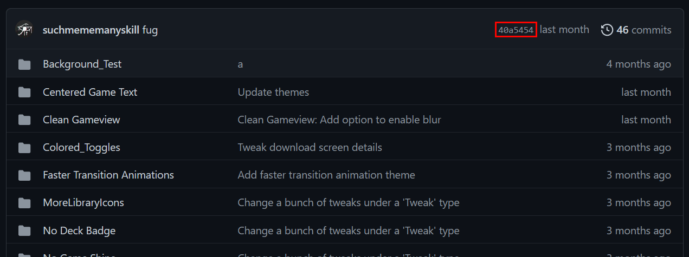

# Submit To DeckThemes.com
This page contains information on how to [submit a Theme or Pack for CSS Loader or Audio Loader](https://deckthemes.com/submit/), respectively. 

If you need any help submitting a Theme or Pack, [contact us via Discord](https://discord.gg/HsU72Kfnpf)

# Submission Criteria
DeckThemes has specific criteria on all submissions

## CSS Theme Requirements
- I am the original author of this theme or have permission from the original author to make this submission.
- All copyright of this theme's contents belong to the listed author or is clearly attributed.
- This theme's target has been marked appropriately and only styles said target.
- This theme works properly on the latest beta and stable versions of SteamOS, [Decky Loader](https://github.com/SteamDeckHomebrew/decky-loader) and [CSS Loader](https://github.com/suchmememanyskill/SDH-CssLoader).
- This theme only uses * or !important if absolutely necessary.
- This theme is under 10MB in size and uses the least disk space possible.
- This theme's preview image does not include text unless it is necessary to describe changes that can be made.
- This theme is safe for work and does not contain any sexual, drug-related, or profane content.
- This theme prefixes any CSS variables with a unique identifier.
- This theme does not bundle any other themes with it, and uses dependencies where necessary.
- If this theme targets the keyboard, it applies to the default keyboard.
- If this is a system-wide theme that also targets the keyboard, the keyboard theming is toggleable

## Audio Pack Requirements
These requirements must be followed for all packs.

- You are the original author of the pack or have permission from the original author to make a pull request
- All copyright of the pack's contents belong to the listed author or are cited in the description and repository linked in the pull request
- The pack works properly on the latest versions of SteamOS for Steam Deck, [Decky Loader](https://github.com/SteamDeckHomebrew/decky-loader), and [Audio Loader](https://github.com/EMERALD0874/SDH-AudioLoader)
- The pack is under 10MB in size and uses the least disk space possible
- The pack is safe for work and does not contain any sexual, drug-related, or profane content
- The pack does not contain loud, distorted, or otherwise bad-faith sound files
- The pack is only for either music or sounds and only adds or modifies the intended sound files

### Music Pack Requirements
All music packs with copyrighted content that do not meet one of the following criteria will most likely be denied. If you are unsure whether your music pack meets one of these criteria, [please reach out to us](#-support).

- Original compositions and performances
- Copyright-free and public-domain performances
- Music with explicit permission from the original author
- Music from other console firmware menus\*
- Other exceptions made by the development team

!> Console firmware music must still be approved by repository maintainers. Music that is unlikely to be used by anyone but the author and music from first-party applications (ex. Wii Shop, Nintendo eShop) may be denied.

# Submitting a Theme or Pack
DeckThemes supports 3 ways to [submit a Theme or Pack](https://deckthemes.com/submit/)

## Git (Preferred)
*Supported by CSS Loader and Audio Loader*

To submit a theme via git, 3 fields need to be filled in:

#### Repo URL
This is the Url of your repository hosted online. Usually this is hosted on github.

?> Example: `https://github.com/suchmememanyskill/Steam-Deck-Themes`

#### Commit ID
A commit is a 'version' of your code. Usually the latest commit of a repository is used, but, with this system, you can choose your own version to submit. 

If this field is left blank, the latest commit of the provided repository is used

?> Example: `40a5454`

#### Subfolder
The subfolder is the folder path to your theme, taking the repository as root folder.

?> Example: `Clean Gameview`, Assuming your repository contains a folder called `Clean Gameview`

## Zip
*Supported by CSS Loader and Audio Loader*

A zip submission is very simple. The only required part is to upload a zip file, containing the theme or pack on the root of the zip

## CSS Only
*Supported by CSS Loader only*

CSS Only submissions are special. They are referred as 'Snippets' and as the name suggests, you can paste css into a text field, and it'll automagically be turned into a theme compatible with CSS Loader. The snippet will be injected into the 'SP', 'QuickAccess' and 'MainMenu' tabs